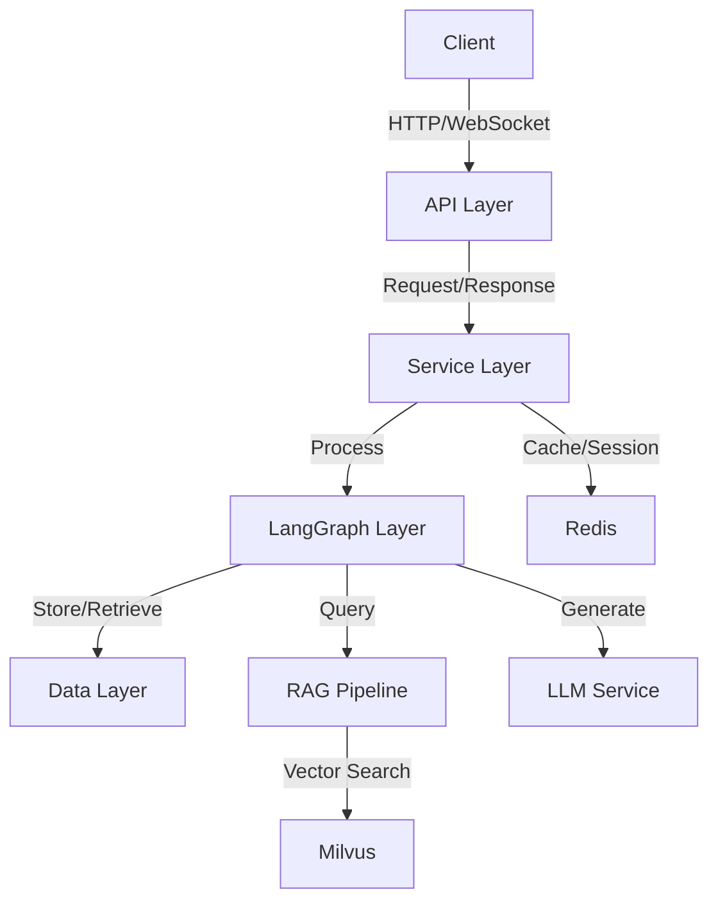
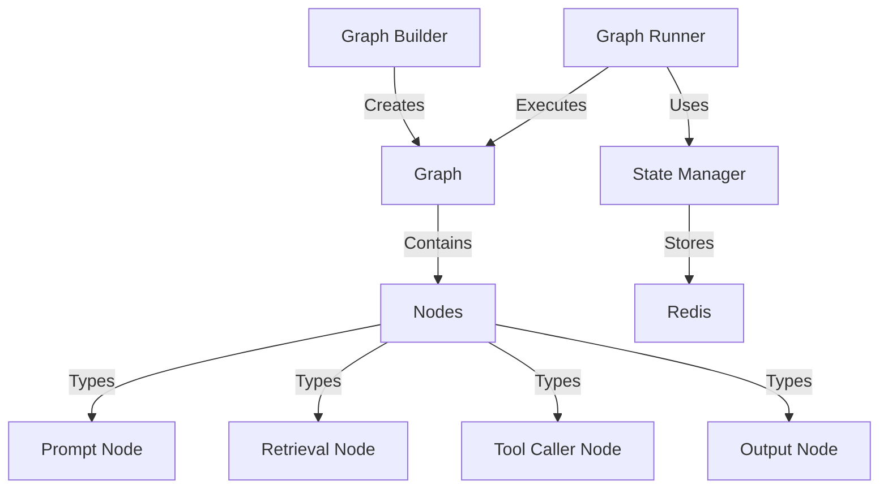
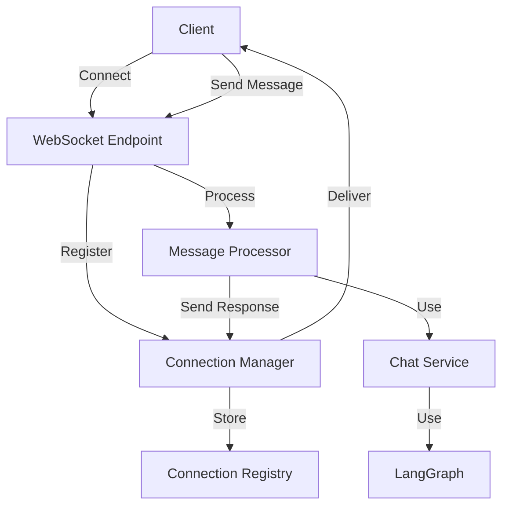

# Design Document: LangGraph Refactoring with WebSocket Integration

## Overview

This design document outlines the architecture and implementation details for refactoring the LangGraph system while integrating WebSocket support for real-time communication. The current implementation has several architectural issues including a monolithic structure, lack of proper error handling, and missing validation. This refactoring will address these issues while enhancing the system with WebSocket capabilities and maintaining compatibility with the existing API.

The refactored system will follow a modular architecture with clear separation of concerns, robust error handling, proper input/output validation, and efficient use of Redis for caching and session management. The WebSocket integration will enable real-time, bi-directional communication between users and AI teachers, with support for RAG-enhanced responses.

## Architecture

### High-Level Architecture

The refactored system will follow a layered architecture with the following components:

1. **API Layer**: FastAPI endpoints for HTTP and WebSocket communication
2. **Service Layer**: Business logic for chat, teacher, and RAG services
3. **LangGraph Layer**: Modular LangGraph components for AI processing
4. **Data Layer**: Redis for caching, session management, and pub/sub; Milvus for vector storage



### LangGraph Architecture

The LangGraph system will be refactored into a modular architecture with the following components:

1. **Node Interface**: Base interface for all LangGraph nodes
2. **Node Implementations**: Concrete implementations for different node types
3. **Graph Builder**: Factory for constructing graphs from nodes
4. **Graph Runner**: Execution engine for running graphs



### WebSocket Architecture

The WebSocket system will be implemented with the following components:

1. **WebSocket Manager**: Manages WebSocket connections and message routing
2. **Connection Handler**: Handles individual WebSocket connections
3. **Message Processor**: Processes incoming messages and generates responses
4. **Session Manager**: Manages user sessions and state



## Components and Interfaces

### LangGraph Components

#### 1. Base Node Interface

```python
from abc import ABC, abstractmethod
from typing import Dict, Any, Optional
from pydantic import BaseModel

class NodeInput(BaseModel):
    """Base model for node input"""
    pass

class NodeOutput(BaseModel):
    """Base model for node output"""
    pass

class Node(ABC):
    """Base interface for all LangGraph nodes"""
    
    @abstractmethod
    async def process(self, input_data: NodeInput) -> NodeOutput:
        """Process input data and return output"""
        pass
    
    @abstractmethod
    async def validate_input(self, input_data: Any) -> NodeInput:
        """Validate and convert input data to NodeInput"""
        pass
    
    @abstractmethod
    async def validate_output(self, output_data: Any) -> NodeOutput:
        """Validate and convert output data to NodeOutput"""
        pass
```

#### 2. Prompt Node

```python
from typing import Dict, Any, Optional, List
from pydantic import BaseModel, Field

class PromptNodeInput(NodeInput):
    """Input model for PromptNode"""
    messages: List[Dict[str, str]] = Field(..., description="List of messages")
    system_prompt: Optional[str] = Field(None, description="System prompt")
    context: Optional[Dict[str, Any]] = Field(None, description="Additional context")

class PromptNodeOutput(NodeOutput):
    """Output model for PromptNode"""
    prompt: str = Field(..., description="Generated prompt")
    messages: List[Dict[str, str]] = Field(..., description="Processed messages")

class PromptNode(Node):
    """Node for generating prompts"""
    
    async def process(self, input_data: PromptNodeInput) -> PromptNodeOutput:
        """Generate prompt from input data"""
        # Implementation
        pass
    
    async def validate_input(self, input_data: Any) -> PromptNodeInput:
        """Validate and convert input data to PromptNodeInput"""
        return PromptNodeInput(**input_data)
    
    async def validate_output(self, output_data: Any) -> PromptNodeOutput:
        """Validate and convert output data to PromptNodeOutput"""
        return PromptNodeOutput(**output_data)
```

#### 3. Retrieval Node

```python
from typing import Dict, Any, Optional, List
from pydantic import BaseModel, Field

class RetrievalNodeInput(NodeInput):
    """Input model for RetrievalNode"""
    query: str = Field(..., description="Query string")
    teacher_id: Optional[str] = Field(None, description="Teacher ID")
    top_k: int = Field(5, description="Number of documents to retrieve")
    filter_expr: Optional[str] = Field(None, description="Filter expression")

class RetrievalNodeOutput(NodeOutput):
    """Output model for RetrievalNode"""
    documents: List[Dict[str, Any]] = Field(..., description="Retrieved documents")
    query: str = Field(..., description="Original query")

class RetrievalNode(Node):
    """Node for retrieving documents"""
    
    def __init__(self, milvus_client):
        self.milvus_client = milvus_client
    
    async def process(self, input_data: RetrievalNodeInput) -> RetrievalNodeOutput:
        """Retrieve documents from Milvus"""
        # Implementation with error handling and retries
        pass
    
    async def validate_input(self, input_data: Any) -> RetrievalNodeInput:
        """Validate and convert input data to RetrievalNodeInput"""
        return RetrievalNodeInput(**input_data)
    
    async def validate_output(self, output_data: Any) -> RetrievalNodeOutput:
        """Validate and convert output data to RetrievalNodeOutput"""
        return RetrievalNodeOutput(**output_data)
```

#### 4. Graph Builder

```python
from typing import Dict, Any, List, Type
from pydantic import BaseModel

class GraphConfig(BaseModel):
    """Configuration for graph construction"""
    nodes: Dict[str, Dict[str, Any]]
    edges: List[Dict[str, str]]

class GraphBuilder:
    """Factory for constructing graphs from nodes"""
    
    def __init__(self):
        self.node_registry = {}
    
    def register_node(self, node_type: str, node_class: Type[Node]):
        """Register a node type"""
        self.node_registry[node_type] = node_class
    
    def build_graph(self, config: GraphConfig) -> Graph:
        """Build a graph from configuration"""
        # Implementation
        pass
```

### WebSocket Components

#### 1. WebSocket Manager

```python
from typing import Dict, Any, Optional, List
from fastapi import WebSocket
import asyncio

class ConnectionManager:
    """Manages WebSocket connections"""
    
    def __init__(self):
        self.active_connections: Dict[str, Dict[str, WebSocket]] = {}
        self.lock = asyncio.Lock()
    
    async def connect(self, websocket: WebSocket, user_id: str, teacher_id: str):
        """Register a new connection"""
        await websocket.accept()
        async with self.lock:
            if user_id not in self.active_connections:
                self.active_connections[user_id] = {}
            self.active_connections[user_id][teacher_id] = websocket
    
    async def disconnect(self, user_id: str, teacher_id: str):
        """Remove a connection"""
        async with self.lock:
            if user_id in self.active_connections:
                if teacher_id in self.active_connections[user_id]:
                    del self.active_connections[user_id][teacher_id]
                if not self.active_connections[user_id]:
                    del self.active_connections[user_id]
    
    async def send_message(self, user_id: str, teacher_id: str, message: Dict[str, Any]):
        """Send a message to a specific connection"""
        if user_id in self.active_connections and teacher_id in self.active_connections[user_id]:
            websocket = self.active_connections[user_id][teacher_id]
            await websocket.send_json(message)
```

#### 2. WebSocket Endpoint

```python
from fastapi import APIRouter, WebSocket, WebSocketDisconnect, Depends, Header
from typing import Optional

router = APIRouter()
connection_manager = ConnectionManager()

async def get_token_data(token: str = Header(...)):
    """Validate token and extract user data"""
    # Implementation
    return {"user_id": "user123"}

@router.websocket("/ws/{teacher_id}")
async def websocket_endpoint(
    websocket: WebSocket,
    teacher_id: str,
    token_data: dict = Depends(get_token_data)
):
    user_id = token_data["user_id"]
    await connection_manager.connect(websocket, user_id, teacher_id)
    try:
        while True:
            data = await websocket.receive_json()
            # Process message
            response = await process_message(user_id, teacher_id, data)
            await connection_manager.send_message(user_id, teacher_id, response)
    except WebSocketDisconnect:
        await connection_manager.disconnect(user_id, teacher_id)
```

### Redis Integration

#### 1. Redis Client

```python
import aioredis
from typing import Dict, Any, Optional, List
import json
import asyncio

class RedisClient:
    """Enhanced Redis client with TTL support"""
    
    def __init__(self, url: str, pool_size: int = 10):
        self.url = url
        self.pool_size = pool_size
        self.pool = None
        self.connected = False
    
    async def connect(self):
        """Connect to Redis"""
        self.pool = await aioredis.create_redis_pool(
            self.url,
            minsize=5,
            maxsize=self.pool_size
        )
        self.connected = True
    
    async def json_set(self, key: str, data: Dict[str, Any], ttl: Optional[int] = None) -> bool:
        """Set JSON data with optional TTL"""
        if not self.connected:
            await self.connect()
        
        try:
            json_data = json.dumps(data)
            await self.pool.set(key, json_data)
            if ttl is not None:
                await self.pool.expire(key, ttl)
            return True
        except Exception as e:
            logger.error(f"Redis error in json_set: {e}")
            return False
    
    async def set_expiration(self, key: str, ttl: int) -> bool:
        """Set expiration for a key"""
        if not self.connected:
            await self.connect()
        
        try:
            return await self.pool.expire(key, ttl)
        except Exception as e:
            logger.error(f"Redis error in set_expiration: {e}")
            return False
```

## Data Models

### LangGraph Models

```python
from pydantic import BaseModel, Field
from typing import Dict, Any, List, Optional
from enum import Enum

class NodeType(str, Enum):
    PROMPT = "prompt"
    RETRIEVAL = "retrieval"
    TOOL_CALLER = "tool_caller"
    OUTPUT = "output"

class NodeConfig(BaseModel):
    """Configuration for a node"""
    type: NodeType
    config: Dict[str, Any] = Field(default_factory=dict)

class EdgeConfig(BaseModel):
    """Configuration for an edge"""
    source: str
    target: str
    condition: Optional[str] = None

class GraphState(BaseModel):
    """State of a graph execution"""
    graph_id: str
    node_states: Dict[str, Any] = Field(default_factory=dict)
    current_node: Optional[str] = None
    completed: bool = False
    error: Optional[Dict[str, Any]] = None
```

### WebSocket Models

```python
from pydantic import BaseModel, Field
from typing import Dict, Any, List, Optional
from enum import Enum
import uuid
from datetime import datetime

class MessageType(str, Enum):
    USER = "user"
    ASSISTANT = "assistant"
    SYSTEM = "system"
    ERROR = "error"

class WebSocketMessage(BaseModel):
    """Message sent over WebSocket"""
    id: str = Field(default_factory=lambda: str(uuid.uuid4()))
    type: MessageType
    content: str
    timestamp: datetime = Field(default_factory=datetime.utcnow)
    metadata: Dict[str, Any] = Field(default_factory=dict)

class ChatSession(BaseModel):
    """Chat session model"""
    id: str = Field(default_factory=lambda: str(uuid.uuid4()))
    user_id: str
    teacher_id: str
    created_at: datetime = Field(default_factory=datetime.utcnow)
    updated_at: datetime = Field(default_factory=datetime.utcnow)
    is_active: bool = True
    metadata: Dict[str, Any] = Field(default_factory=dict)
```

## Error Handling

### Error Types

```python
from enum import Enum

class ErrorType(str, Enum):
    VALIDATION_ERROR = "validation_error"
    NODE_ERROR = "node_error"
    GRAPH_ERROR = "graph_error"
    RETRIEVAL_ERROR = "retrieval_error"
    LLM_ERROR = "llm_error"
    REDIS_ERROR = "redis_error"
    WEBSOCKET_ERROR = "websocket_error"
    AUTHENTICATION_ERROR = "authentication_error"
```

### Error Handling Strategy

1. **Node-Level Error Handling**:
   - Each node will implement error handling with retries for transient errors
   - Nodes will provide detailed error information for debugging
   - Nodes will have fallback strategies for critical errors

2. **Graph-Level Error Handling**:
   - The graph runner will catch and handle errors from nodes
   - The graph state will be preserved for recovery
   - Alternative paths will be taken when possible

3. **Service-Level Error Handling**:
   - Services will implement circuit breakers for external dependencies
   - Services will provide graceful degradation when components fail
   - Services will log detailed error information

4. **API-Level Error Handling**:
   - API endpoints will validate inputs and return appropriate error responses
   - WebSocket connections will handle disconnections gracefully
   - Rate limiting will be implemented to prevent abuse

## Testing Strategy

### Unit Testing

1. **Node Tests**:
   - Test each node type in isolation
   - Test input/output validation
   - Test error handling and fallbacks

2. **Graph Tests**:
   - Test graph construction
   - Test graph execution with different configurations
   - Test error propagation and recovery

3. **WebSocket Tests**:
   - Test connection establishment and authentication
   - Test message processing
   - Test disconnection handling

### Integration Testing

1. **End-to-End Tests**:
   - Test complete chat flow from WebSocket to LangGraph to response
   - Test RAG integration with real queries
   - Test error scenarios and recovery

2. **Performance Tests**:
   - Test system under load with multiple concurrent connections
   - Test Redis performance with different cache strategies
   - Test LangGraph performance with complex graphs

### Test Tools

- **pytest** for unit and integration tests
- **pytest-asyncio** for testing async code
- **pytest-cov** for code coverage
- **locust** for load testing

## Implementation Plan

The implementation will follow a phased approach:

1. **Phase 1**: Refactor LangGraph into modular components
2. **Phase 2**: Implement WebSocket support
3. **Phase 3**: Integrate RAG with WebSocket chat
4. **Phase 4**: Implement Redis TTL and caching improvements
5. **Phase 5**: Add security and performance enhancements

Each phase will include:
- Implementation of required components
- Unit and integration tests
- Documentation updates
- Performance benchmarks